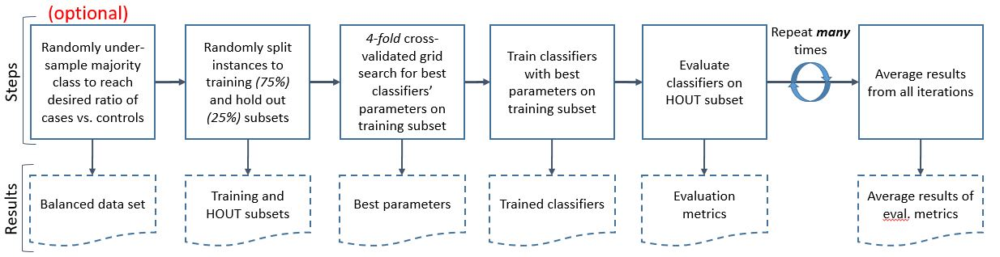

A good practice to evaluate your classifier is to grid search, train and test it many many times. 

In this post I will not delve into explaining the saint train-test-evaluate triology, neither will dig into elaborating the mechanics of k-fold cross-validation or grid search because I assume it is must-know basics of which readers are already aware. Instead in this post I want to emphasize the importance to run train-test-evaluate procedure for many times as the image above suggests. This will give you the true picture on how stable is your classifier and how capable it is to capture the true underlying patterns and not the noise. Actually, this was my very first big lesson learned when I started the dissertation, because at the beginning I thought one run with cross-validated grid search will suffice. 

Have in mind that the first step of rebalancing might be necessary only in case of higher class imbalance (I'd say above 1:10). As well training and hold out (evaluation) subsets can be split in different proportions (in most of the cases training data should be bigger), the same applies for choosing k for k-fold cross-validation. 

**But how many times to iterate the procedure?**
In the scientific articles I have seen very wide range of iterations (from 10 to hundreds), but my supervisor would always say that >1,000 is what should be sought in research. I'd say it depends on circumstances: the goal or complexity of the research topic, data size, time you have to run experiments, machines you use, stability and complexity of algorithms and, of course, what level of research perfection you want to achieve. I ran my experiments for 20-50 times. My standard deviations of evaluation metrics were very low, indicating that models are stable, thus running additional 950 times most likely would not add anything new to it. In commercial environment most likely you would aim for quicker but not necessarily perfect results, thus number of runs could even be as low as few ot ten.

        def ClassificationCVAndShuffleSplit(X, y, iterations, typeOfExperiment, ListOfClassifiers, url):
            # X: pandas dataframe - data set with independent variables. 
            # y: list,array - dependent variable
            # iterations: integer - number of random train/test splits
            # typeOfExperiment: string - name of the experiments which will be included in the file name
            # ListOfClassifiers: list of integer - specify which of 6 classifiers to experiment with, 
            # e.g. [0,1] will select "Logistic_regression" and "RBF_SVM" for experiments.
            # url: string - define where to save results in you local machine

            names_full = [ 
                    "Logistic_regression", 
                    "RBF_SVM", 
                    "Decision_Tree",
                    "Random_Forest", 
                    "AdaBoost", 
                    "Naive_Bayes"
                    ]
            classifiers_full = [
                LogisticRegression(penalty = 'l2'),
                Pipeline([("normalize", preprocessing.Normalizer(norm='l2')), ("svm", SVC(gamma=0.01, C=0.11, probability= True))]),
                DecisionTreeClassifier(max_depth=5),
                RandomForestClassifier(max_depth=5, n_estimators=10, n_jobs=6),
                AdaBoostClassifier(),
                GaussianNB()
                ]

            parameters = {
                'Logistic_regression': dict(penalty=['l2']),
                'RBF_SVM': dict(svm__C=[10,100,1000,10000,100000], svm__gamma=[0.01,0.1,1,10,100]),#grid3
                'Decision_Tree':dict(max_depth=[5, 10, 50, 100]),
                'Random_Forest': dict(max_depth=[5, 10, 50], n_estimators=[10, 50, 100]),
                "AdaBoost": dict(n_estimators=[10, 50, 100]),
                "Naive_Bayes": dict()
            }

            names = [names_full[i] for i in ListOfClassifiers]
            classifiers = [classifiers_full[i] for i in ListOfClassifiers]

            index = np.arange(0,iterations,1)
            columns = [[name+'_auc', name+'_scores', name+'_predLabel', name+'_truth', name+'_bestParams'] for name in names]
            columns = sum(columns,[])
            exp = pd.DataFrame(index=index, columns=columns)
            rs = cross_validation.ShuffleSplit(len(y), n_iter=iterations, test_size=.25, random_state=0)
            i =0
            y = np.array(y)
            for train_index, test_index in rs:
                if i%10==0:
                    start1 = time.time()
                for name, clf in zip(names, classifiers):
                        #start2 = time.time()
                        X_train = X.iloc[train_index] 
                        y_train = y[train_index]
                        X_test = X.iloc[test_index]
                        y_test = y[test_index]
                        clf_parameters = parameters[name]
                        clf_GS = GridSearchCV(clf, clf_parameters, cv=4, scoring='roc_auc', n_jobs = 6)
                        clf_GS.fit(X_train, y_train)
                        exp.loc[i,name+'_bestParams'] = str(clf_GS.best_params_)
                        #print 'Best parameters ', clf_GS.best_params_
                        pred_prob = clf_GS.predict_proba(X_test)
                        pred_prob_class1 = pred_prob[:,1]
                        pred_label = clf_GS.predict(X_test)
                        auc = metrics.roc_auc_score(y_test, pred_prob_class1)

                        exp.loc[i,name+'_scores']= " ".join(str(x) for x in pred_prob_class1)
                        exp.loc[i,name+'_predLabel']=" ".join(str(x) for x in pred_label) 
                        exp.loc[i,name+'_truth']=" ".join(str(x) for x in y_test)
                        exp.loc[i,name+'_auc']=auc

                        #end2 = time.time()
                        #print 'Iteration ', i, 'classifier ', name, ', time ', (end2-start2)

                exp.loc[i:i].to_csv(path_or_buf=url+'ClassificationCVAndShuffleSplit'+'_'+typeOfExperiment+'.csv',mode='ab', index=None, header = False)

                i +=1
                if i%10==0 and i!=0:
                    end1 = time.time()
                    print 'Done iterations: ', i
                    print 'In seconds: ', (end1 - start1)            
            return exp
