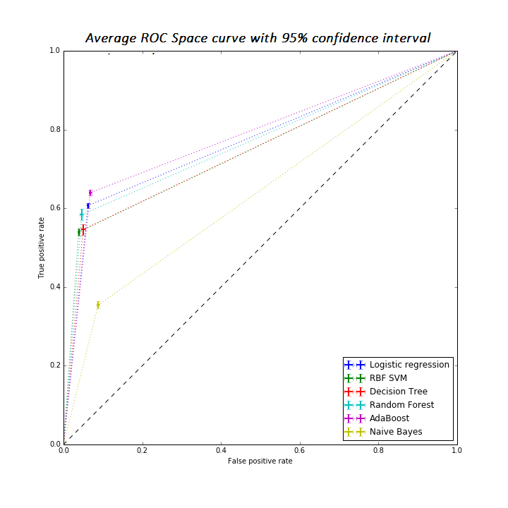

Since now we have evaluation results from many iterations, we would like to check how stable they are. That's what the ROC Space curve is for. 



In addition to averaged AUC, specificity and sensitivity as a performance diagnostics I plotted averaged ROC Space curve. It represents averaged sensitivity and specificity metrics over number of iterations on ROC plot with 95% confidence interval error bars.
I used simplified version of ROC Space curve with only one point depicted. Nevrtheless, more sophisticated versions of averaging ROC Space curves exist - merging all iterations into 1 curve, vertical averaging, threshold averaging <sup>1</sup>.

The interpretation of such curve is straight forward - the most desirable performance outcome would result in dots placed on the furthest upper left corner with narrow confidence intervals. In our case the error bars are sufficiently narrow confirming stable performance of classifiers per varying train/test splits, though the true positive rate (or sensitivity) is too low.

Below I share the code stubs for plotting avergaed ROC Space curve, as shown above in the image.


```python
def ROCSpace_1point(title, expNo, filepath_AllOther, likelyOrNonlikely):
    # title: string - title of the chart
    # expNo: integer - experiment integer [1,2,3,4]
    # filepath_AllOther: string - url to the files with experiment results
    # likelyOrNonlikely: integer - 0 for likely, or 1 for nonlikely - to specify the controls 
    models = [
    'Logistic regression',
    'RBF SVM',
    'Decision Tree',
    'Random Forest',
    'AdaBoost',
    'Naive Bayes'
    ]

    exp = [['Exp1_HAEpositive&likely.csv','Exp1_HAEpositive&nonlikely.csv'],
       ['Exp2_HAEpositive&likely.csv','Exp2_HAEpositive&nonlikely.csv'],
       ['Exp3_HAEpositive&likely.csv','Exp3_HAEpositive&nonlikely.csv'],
       ['Exp4_HAEpositive&likely.csv','Exp4_HAEpositive&nonlikely.csv']
    ]
    
    usecols_AllOther = [[0,2,3],[5,7,8],[10,12,13],[15,17,18],[20,22,23],[25,27,28]]

    plt.figure(figsize=[10,10])
    df = pd.DataFrame(index=models, columns=['AUC_mean','AUC_std','Sensitivity','Specificity'])

    for i, model in enumerate(models):
        pred_truthLabels = pd.read_csv(filepath_AllOther+exp[expNo-1][likelyOrNonlikely], usecols = usecols_AllOther[i], header=None, names=['AUC','PredLabels','Truth'])
        pred_truthLabels['PredLabels'] = pred_truthLabels['PredLabels'].apply(lambda x: [float(i) for i in x.split()])
        pred_truthLabels['Truth'] = pred_truthLabels['Truth'].apply(lambda x: [float(i) for i in x.split()])

        pred_truthLabels['Sensitivity'] = pred_truthLabels.apply(lambda x: metrics.recall_score(x['Truth'],x['PredLabels']), axis=1)
        pred_truthLabels['Specificity'] = pred_truthLabels.apply(lambda x: 1.0-metrics.roc_curve(x['Truth'],x['PredLabels'])[0][1], axis=1)

        xerror= 1.96*(1.0-pred_truthLabels['Specificity']).std()/np.sqrt(pred_truthLabels.shape[0])
        yerror = 1.96*pred_truthLabels['Sensitivity'].std()/np.sqrt(pred_truthLabels.shape[0])
        xmean = (1.0-pred_truthLabels['Specificity']).mean()
        ymean = pred_truthLabels['Sensitivity'].mean()
        plt.errorbar([0,xmean,1], [0,ymean,1], 
                     yerr=[[0,yerror,0], [0,yerror,0]], xerr=[[0,xerror,0], [0,xerror,0]], 
                     linestyle = ':',elinewidth=2,linewidth = 1, label =model)
        df.ix[model,'AUC_mean'] = round(pred_truthLabels['AUC'].mean(), 4)
        df.ix[model,'AUC_std'] = round(pred_truthLabels['AUC'].std(), 4)
        df.ix[model,'Sensitivity'] = round(ymean, 4)
        df.ix[model,'Specificity'] = round(pred_truthLabels['Specificity'].mean(),4)

    plt.plot([0, 1], [0, 1], 'k--')
    plt.legend(loc='lower right')
    plt.xlabel('False positive rate')
    plt.ylabel('True positive rate')
    plt.title(title)
    plt.savefig(filepath_AllOther+'ROCplot_'+exp[expNo-1][likelyOrNonlikely][0:-4])
    plt.show()
    df.to_csv(path_or_buf=filepath_AllOther+'Analysis_'+exp[expNo-1][likelyOrNonlikely])
```
<sup>1</sup> Fawcett, T. (2005) "An introduction to ROC analysis". Pattern Recognition Letters 27 (2006) 861–874.
