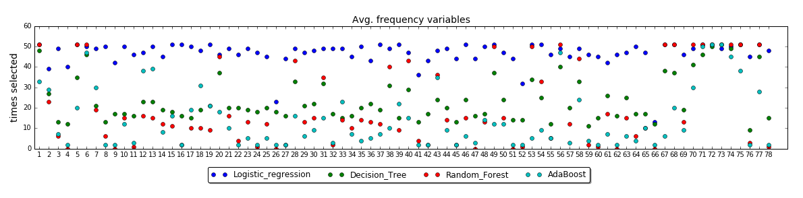
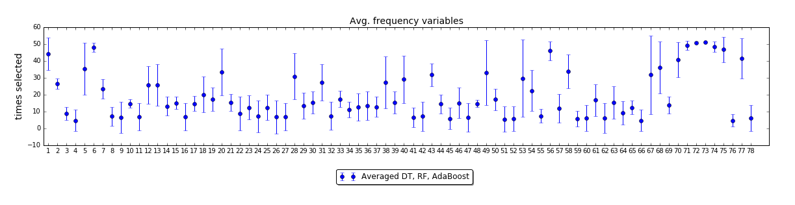

And now about my creative approach to analyse feature importance with cross-validated recursive feature elimination method from sklearn.

To start from the aim, I was seeking to understand which variables are redundant, correlated and thus introduce noise into the models, and which variables are the most deterministic. Thus, I was expecting that elimination of features would improve the overall performance or, at least, reduce the computational complexity by reducing dimensionality (I had 240 variables at the beginning). 

To conduct the experiment I used the following function. It is important to note that only those estimators can be used within RFECV which have _coef_ as an attribute available, e.g. SVM with RBF kernel and Naive Bayes classifier could not be used, thus I ran experiments only with logistic regression, decision tree, random forest and AdaBoost estimators. 
```python
from sklearn.feature_selection import RFECV
```

With each of four classifiers I repeated RFECV for 50 runs and averaged outcomes. The results were as follows: in average logistic regression retained 230 out of 240 variables, decision tree - 75, random forest - 73, AdaBoost - 33. The decrease of avg. AUC in most of the cases was marginal - logistic regression, random forest and AdaBoost detoriorated only by 2%, decision tree - by 12%. This confirms a major improvement in computational efficiency of the task (especially in the tree based classifiers) and redundancy of many features. 

For further analysis I plot features on x-axis and on y-axis the number of times (out of 50) when feature was chosen for inclusion in the final reduced model. (below for simplicity reasons I depict only a fraction of 78 features out of all 240)



It is quite clear that some features are more dispersed than the others. E.g. features 6, 71-74 are unanimously selected by all 4 models in majority of the runs. Contrary, all models cannot agree on 53, 67 features. To better visualize this disagreement I further exclude logistic regression from the analysis, average 'times selected' of remaining three models - decision tree, random forest and AdaBoost - and add error bars, which results in following plot.  



The longer the whiskers of error bars the more disagreement between three classifiers, while short whiskers and high position of dots indicate big importance of the feature across all models.

As always, below are provided code stubs for reproducing similarexperiment and the plots.


```python
def ROCSpace_1point(pred_truthLabels, model):
    '''
    This function takes as input predefined dataframe with results of experimental runs for one classifier 
    and returns a plot of averaged ROC space curve.
    pred_truthLabels: dataframe - for one classifier containing 2 columns: 'Truth' with lists of true labels and 
    'PredLabels' with lists of predicted labels from test subsets. Each row represents different iteration of experiment, 
    eg. if experiment was run 100 times there should be 100 rows in the dataframe.
    model: string - name of classifier.
    '''

    plt.figure(figsize=[10,10])
    
    pred_truthLabels['Sensitivity'] = pred_truthLabels.apply(lambda x: metrics.recall_score(x['Truth'],x['PredLabels']), axis=1)
    pred_truthLabels['Specificity'] = pred_truthLabels.apply(lambda x: 1.0-metrics.roc_curve(x['Truth'],x['PredLabels'])[0][1], axis=1)
    xerror= 1.96*(1.0-pred_truthLabels['Specificity']).std()/np.sqrt(pred_truthLabels.shape[0])
    yerror = 1.96*pred_truthLabels['Sensitivity'].std()/np.sqrt(pred_truthLabels.shape[0])
    xmean = (1.0-pred_truthLabels['Specificity']).mean()
    ymean = pred_truthLabels['Sensitivity'].mean()
    
    plt.errorbar([0,xmean,1], [0,ymean,1], 
                 yerr=[[0,yerror,0], [0,yerror,0]], xerr=[[0,xerror,0], [0,xerror,0]], 
                 linestyle = ':',elinewidth=2,linewidth = 1, label =model)
    plt.plot([0, 1], [0, 1], 'k--')
    plt.legend(loc='lower right')
    plt.xlabel('False positive rate')
    plt.ylabel('True positive rate')
    plt.title(title)
    plt.show()
```
<sup>1</sup> Fawcett, T. (2005) "An introduction to ROC analysis". Pattern Recognition Letters 27 (2006) 861–874.
