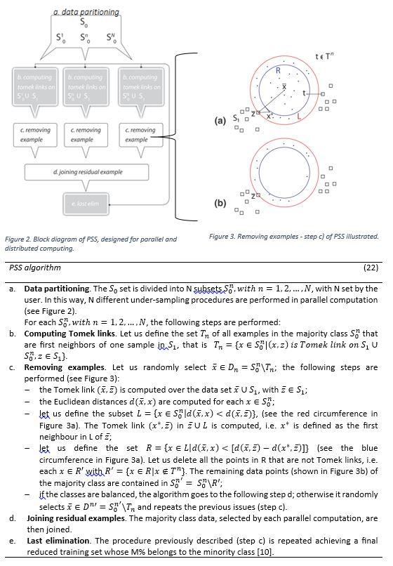

More conventional methods to tackle class imbalance are either under-sampling of majority class, over-sampling of minority class or hybrid. Since the data I analysed was severely imbalanced the best shot was to try an under-sampling technique. The one I came across is called Parallel Selective Sampling. It is specifically designed for Big Data and high imbalance scenarios. 

Many real-word applications of machine learning classifiers have to identify rare events from very large data sets. Consequently two problematic issues add on: the computational complexity dependent on the size of the data set and the need to pursue a fairly high rate of correct detections in the minority class. Due to these issues many classification algorithms present great limitations on large data sets and show a performance degradation due to class imbalance. One of the ways to overcome these limitations is a selection of examples by sampling a small number of patterns from the majority class to reduce both the number of data and the imbalance. Such a procedure is well known as “under-sampling” method. Several under-sampling methods are presented in literature. In this project I have chosen to experiment with one, named Parallel Selective Sampling (PSS), that is specifically adopted for both big data and severe imbalance challenges. It was developed by co-authors Annarita D’Addabbo and Rosalia Maglietta, and published in 2015. PSS is a filter method which can be combined with a variety of classification strategies. It is based on the idea (usually used in SVM) that only training data, near the separating boundary (for classification), are relevant. In this way the core information from the training data - i.e. the training data points near the separating boundary - is preserved while the size of the training set is effectively decreased. Relevant examples from the majority class are selected and used in the successive classification step with desired classifier. Due to the complex computational requirements, PSS is conceived and designed for parallel and distributed computing <sup>[1]</sup>.

PSS is based on the computation of **Tomek links**, defined as a pair of nearest neighbours of opposite classes. Given {E<sub>1</sub>,E<sub>2</sub>,…E<sub>N</sub>} ∈ R<sup>d</sup> a pair (E<sub>i</sub>,E<sub>j</sub>) is called a Tomek link if E<sub>i</sub> and E<sub>j</sub> have different labels, and there is not an E<sub>l</sub> such that d(E<sub>i</sub>,E<sub>l</sub>)< d(E<sub>i</sub>,E<sub>j</sub>) or d(E<sub>j</sub>,E<sub>l</sub>) < d(E<sub>i</sub>,E<sub>j</sub>), where d( •, •) is the Euclidean distance. Here Tomek links are used to remove samples of majority class staying in areas of input space dense of data belonging to the same class.
Let S= {(**x<sub>1</sub>**,y<sub>1</sub> ),(**x<sub>2</sub>**,y<sub>1</sub> ),…(**x<sub>N</sub>**,y<sub>N</sub>)} be the training set, where x<sub>i</sub>∈R<sup>d</sup>  and y<sub>i</sub>∈{0,1},∀ i=1,…,N. We define S<sub>0</sub> the set of N<sub>0</sub> training data belonging to class y=0 and S<sub>1</sub> the set of N<sub>1</sub>  training data belonging to class y=1, with N<sub>0</sub>≫N<sub>1</sub>. PSS achieves a reduced training set whose percentage M% of the minority class on the total number of examples is chosen by the user.

Below the picture illustrates mechanics and whole algorithm of PSS. For more details please refer to the source<sup>[1]</sup>.



The main adjustment of the algorithm for big data is it's parallelism. Thus for my corpus which was ~90GB of size I reproduced PSS in Apache PySpark implementation and ran it on Microsoft Azure clusters. Below I provide you with both PSS (which could be run in sequential mode as well) and PySpark code. For the later one to work you have to make sure Apache Spark is installed in your local machine. It is highly NOT recommended to try running Spark on your Windows machine, for those reasons I had a Linux Debian set up in which my Spark application worked like a charm on a small subsamples of the data.

```python
from sklearn.neighbors import NearestNeighbors
from sklearn.metrics import pairwise_distances
import itertools as it
import pandas as pd
import numpy as np

def is_tomek(X, y, class_type):
        """is_tomek uses the target vector and the first neighbour of every
        sample point and looks for Tomek pairs. Returning a boolean vector with
        True for majority Tomek links.
        Parameters
        ----------
        X: df, shape (n_samples, n_features)
            Data set with variable values
        y : ndarray, shape (n_samples, )
            Target vector of the data set, necessary to keep track of whether a
            sample belongs to minority or not
        class_type : int or str
            The label of the minority class.
        Returns
        -------
        is_tomek : ndarray, shape (len(y), )
            Boolean vector on len( # samples ), with True for majority samples
            that are Tomek links.
        """

        nn = NearestNeighbors(n_neighbors=2)
        nn.fit(X)
        nn_index = nn.kneighbors(X, return_distance=False)[:, 1]
        # Initialize the boolean result as false, and also a counter
        links = np.zeros(len(y), dtype=bool)
        count = 0

        # Loop through each sample and looks whether it belongs to the minority
        # class. If it does, we don't consider it since we want to keep all
        # minority samples. If, however, it belongs to the majority sample we
        # look at its first neighbour. If its closest neighbour also has the
        # current sample as its closest neighbour, the two form a Tomek link.
        for ind, ele in enumerate(y):

            if ele == class_type:
                continue

            if y[nn_index[ind]] == class_type:

                # If they form a tomek link, put a True marker on this
                # sample, and increase counter by one.
                if nn_index[nn_index[ind]] == ind:
                    links[ind] = True
                    count += 1
        return links

def get_majority_samples_Tomek(positive, negative_sample, class_type):
    X = negative_sample.append(positive)
    y = [0]*negative_sample.shape[0] + [1]*positive.shape[0]
    links = is_tomek(X, y, class_type = class_type)
    majority_samples_Tomek = negative_sample[links[0:negative_sample.shape[0]]]
    return majority_samples_Tomek

def PSS_faster_spark(negative_sample_iterator):
    # Function samples from majority class based on Tomek links and returns reduced samples of majority class
    # Source: Maglietta, R. et al.(2015) Parallel selective sampling method for imbalanced and large data. 
    # negative_sample_iterator: iterable object, returned by PySpark mapPartition function. iterable object contains rows of the partition.
    # the desired balance ratio between classes should be defined empirically
    desired_balance = 2 
    # reads the data of the positive class within each worker
    positive = pd.read_csv('url....') 
    negative_sample = pd.DataFrame([row for row in negative_sample_iterator], dtype = float)
    negative_sample.columns = positive.columns
    neigh_positive = NearestNeighbors(1).fit(positive)
    i = 0
    T = get_majority_samples_Tomek(positive, negative_sample, class_type = 1)
    # repeat under-sampling until the desired balance ratio of cases vs. controls is reached
    while negative_sample.shape[0] > positive.shape[0]*desired_balance: 
        # get subset D of negative_sample (from negative_sample exclude Tomek links)
        checkForT1 = [ind not in T.index.values for ind in negative_sample.index.values]
        D = negative_sample[checkForT1]
        # randomly sample x (hat) from D and find nearest neighbour z from minority class
        xRandom = D.sample(n=1)
        index_z = neigh_positive.kneighbors(xRandom.values, 1, return_distance=False)[0]
        z = positive.iloc[index_z]
        dist_xRandom_to_z = pairwise_distances(X = xRandom,Y = z, metric = 'matching')[0][0]
        dist_from_xRandom_to_otherXs = pairwise_distances(X=xRandom, Y=negative_sample, metric = 'matching')[0]
        # get subset L of negative_sample
        mask_for_L = dist_from_xRandom_to_otherXs<dist_xRandom_to_z
        L = negative_sample[mask_for_L]    
        dist_from_z_to_allInL = pairwise_distances(X=z, Y=L, metric = 'matching')[0]
        xStar = L.iloc[np.argmin(dist_from_z_to_allInL)]
        dist_xStar_to_z = pairwise_distances(X=xStar.reshape(1, -1),Y=z, metric = 'matching')[0][0]
        dist_in_L = dist_from_xRandom_to_otherXs[mask_for_L]
        # get subset R of L
        R = L[dist_in_L<(dist_xRandom_to_z-dist_xStar_to_z)]
        checkForT = [ind not in T.index.values for ind in R.index.values]
        # eliminate samples in R from negative_sample
        eliminate = R[checkForT].index.values
        negative_sample.drop(eliminate, inplace=True)
        i +=1
        
    return negative_sample.values.tolist()

# PySpark specific functions
DELIMITER = ","
def makeRow(line):
    row = line.split(DELIMITER)
    return row

def import_pandas(x):
    # imports pandas library in worker nodes
    import pandas as pd
    return x

def import_sklearn(x):
    # imports specific methods from sklearn library in worker nodes
    from sklearn.neighbors import NearestNeighbors
    from sklearn.metrics import pairwise_distances
    return x

def import_numpy(x):
    # import numpy library in worker nodes
    import numpy as np
    return x

# the url to data which should be under-sampled in a parallelised fashion. This case it was all negative samples.
dirInput = 'url.....csv'

# in some implementations you might need to initialize SparkContext manually. On how to do that see here: http://spark.apache.org/docs/latest/programming-guide.html#initializing-spark
(
sc
    .textFile(dirInput)
    .map(import_pandas)
    .map(import_sklearn)
    .map(import_numpy)
    .map(makeRow)
    .repartition(5) # number of repartitions depend on size of the data, how fast is the algorithm to undersample, how many cases you'd like to have at the end of under-sampling, etc.
    .mapPartitions(PSS_faster_spark)
    .repartition(1) # this step collect the results from the preceeding 5 partitions into one partition which enables us to save results in one file instead of many of them. On computer cluster you should use it with caution because this function collects all remaining data to one machine. If the data is too big the worker may crash.
    .saveAsTextFile('url.....csv')
)

```

<sup>[1]</sup> Maglietta, R. et al. (2015) Parallel selective sampling method for imbalanced and large data classification. Elsevier, vol. 62, 1 September 2015, p. 61–67.
